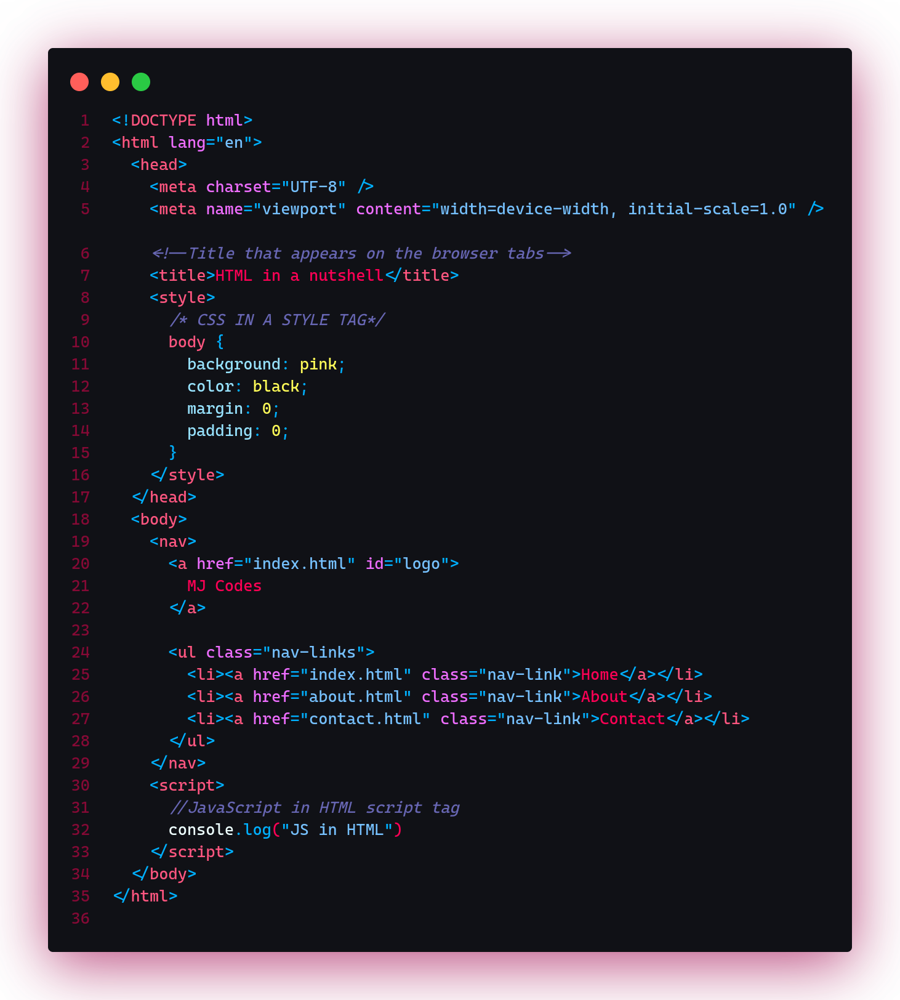

#### Where To Start From

The world of tech has a lot to offer. And I mean it when I say **a lot**. I am not saying this to scare you but you should know and be prepared that there will be a lot of learning with either path you choose. So now let's get into it.

Here are some of the areas/languages/technologies I will talk about:

     1. Web Development
     2. Desktop App Development
     3. Mobile App Development
     4. Game Development
     5. AI & Machine Learning

#### Web Development

15 years ago, this was the easy route because not much was required. All you needed then was HTML, CSS, JavaScript and some PHP. Well nowadays, HTML, CSS and JavaScript are what you need **to get started**. I will have a separate post for each of these to explain them in depth but for now this is all you need to know.

Now it will be up to you to choose what route you want to take among Front-end, Back-end and Full-Stack development.

##### Front-end Development

This is the visual side of things regardless of what path you choose. Whether it is Web Development or Desktop App Development.

Now when it comes to frontend development in web development then you will have to go straight to HTML, CSS and JS. **Yes, there is no way around that**.

##### Pros of Web Development

A strong foundation of web development technologies such as HTML, CSS, JS and any front-end framework has a lot of benefits behind it.
