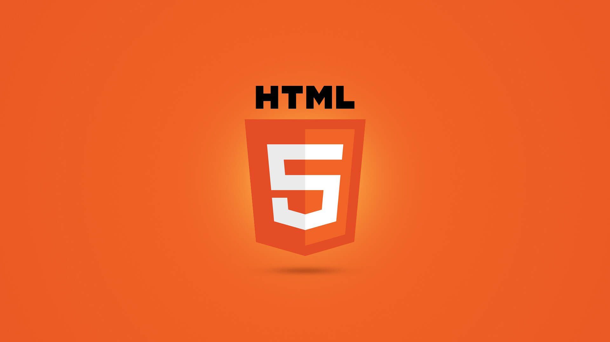
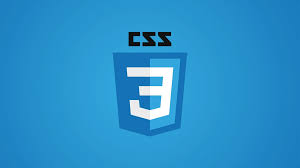

The world of Computer Science let alone programming can feel like a rabbit hole when you do not know much and this is what usually turns people off before they even begin. Computer Science is more complicated and complex compared to other fields with a learning curve that's steeper than learning how to get good at Dark Souls.

Anyway, when I started with web development I jumped from one thing to the next without even understanding what I was doing. Half of 2018 was wasted on how to make a simple navbar (Navigation Menu) and the other half was wasted on how to make that navbar responsive. As much as I still figured it out, I wasted a lot of time. Like **A LOT!**

So, before I begin anything, let me start sharing a few tips that will payoff in the long run regardless of what programming language/technology you want to learn.

#### Do's and Don'ts When Learning How to Code

##### 1. Learn one thing at a time

You are not Elon Musk. Focus one thing until you feel you are ready to move on to another task.

##### 2. Take your time

Unless you are in school and following the school curriculum, learn at your own pace. You are not in competition with anyone. Sure you want to get to the part where you start to build things, but rushing will only make your journey harder and longer. There are concepts I would have understood quicker if I only took my time.

##### 3. Learn by building small projects

This method is considered the most effective way to learn in the world of programming and other fields like cooking.

This is different from building an actual project but rather, a simple one that you can use to experiment with what you are learning. This is a project that grows as your knowledge and understanding grows.

One of the ways I understood CSS Grid and Flexbox was by building [\#BecomingCrimson Site](https://becomingcrimson.netlify.app/).

Now with that out of the way, lets get started.

#### HTML (HyperText Markup Language)

This is the backbone of the web. The thing that started it all (I think...) In fact the web is all HTML. You can have a website or webpage without CSS and JavaScript but you can't have a webpage without HTML.

The HyperText Markup Language, commonly known as HTML, is used to structure and layout text in in the browser. It uses tags to do this and they are pretty much straightforward since most of them are abbreviations of normal words we use from day to day. It is also the easiest to learn.

I highly recommend using the book [Head First HTML and CSS: A Learner's Guide to Creating Standards-Based Web Pages](https://www.amazon.com/gp/product/0596159900/ref=as_li_tl?ie=UTF8&camp=1789&creative=9325&creativeASIN=0596159900&linkCode=as2&tag=booksoncode-20&linkId=f73ca6a5259b33f59fd67a6e8520fbfd) by Elizabeth Robson.

Since this post is all about the roadmap, I will stop here.

#### Cascading Style Sheets (CSS)

CSS is where the learning actually begins. And it is where you definitely have to apply my Tip #2 - Taking your time. CSS is used to style the HTML elements and make it look appealing. It brings in the sense of uniqueness on the World Wide Web. It manipulates the HTML elements and how they should look.

CSS is much harder than HTML and will definitely make you question your life choices from time to time but it is doable. I mean, there are millions of great looking websites on the web and they all use CSS. You have what it takes to learn it as well. If I did it, you can too.

Personally, I never learned CSS with a book. I spent most of my time watching YouTube crash courses on the same and it paid off. But there are times when you will need to refer to some detailed text to help you understand and there is no better place to read and learn CSS than [W3Schools](https://www.w3schools.com/css/default.asp).

After learning HTML and CSS, you are good to go to start making static webpages/sites. But that's not enough in this day and age. Websites need to have some dynamic actions and that's where JavaScript comes in.

#### JavaScript

JavaScript is multi-paradigm programming language for the web and makes up the big 3 of frontend trio. Multi-paradigm simply means there are different ways you can write your code to achieve a task.

JavaScript is used to make websites come alive and add some behavior to them. It is truly a power house of websites. Sure, we can do without it but we need it. Ever clicked a button on a website and something popped up, or you clicked the menu icon while using your phone and menu came sliding? That's all JavaScript and we can do a lot with it not just frontend stuff.

JavaScript is also used on the Backend side of things through Node.js.

Unlike HTML and CSS which are usually learned simultaneously, I recommend you learn JavaScript on its own as a programming language and not as part of the Big 3. Learning JavaScript is an opportunity to learn about programming fundamentals, concepts such as functions, arrays, iterations, common syntax. Once again, apply my Tip #2. Forget everything about HTML and CSS at this point and learn what it actually means to learn a programming language.

What you will learn will be used when learning, reading, and understanding other programming languages like Python, Java, and Kotlin.

#### Where To Next?

When you are done with everything, now is the time to actually build something worth showing to your friends and potential clients, and not just your mom.

Now is the time to **build, Build, and BUILD** and until you are comfortable with making decent static pages.

If you reach this point of your learning journey, you have the freedom of what you need to learn next. If you want to be a frontend developer (Someone who works on the visual side of things) then learn CSS frameworks and JavaScript Frameworks.

If you want to be a backend developer learn then proceed to further learn JavaScript through Node.js or learn PHP and SQL.

#### CSS Frameworks

A framework in Computer Science, simplifies the way we do things. You might have heard of [Bootstrap ](https://getbootstrap.com/)and that it helps in styling. You have many choices to choose from and personally, I have used [MaterializeCSS ](https://materializecss.com/)and currently using [TailwindCSS](https://tailwindcss.com/). I will make a separate blog post on the pros and cons for each.

#### JavaScript Frameworks

Learning a frontend JavaScript framework is usually a game changer and each framework is unique and has its own learning curve. Again, you are free to choose among the following:

1. React (The most popular, made by Facebook)
2. Vue (The easiest, second popular, made by Evan You)
3. Angular (The hardest, made by Google)
4. Svelte (The most unique)
5. And more...

Reaching this far, I really hope what you have read helps with your web development journey and avoid the mistakes that I made when I was just starting off. Until next time😁